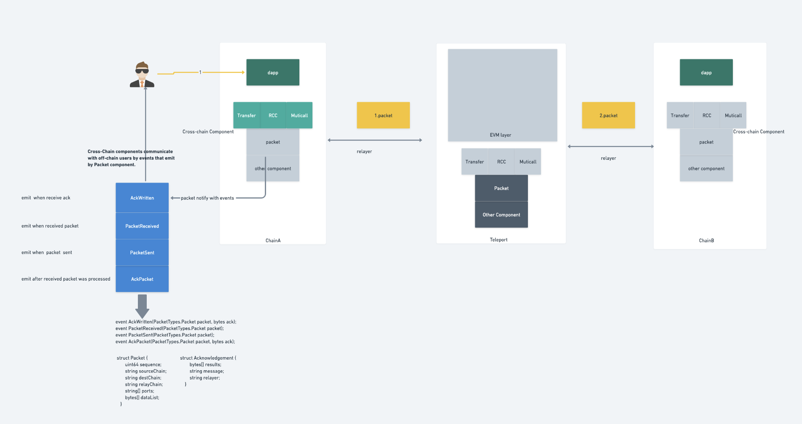
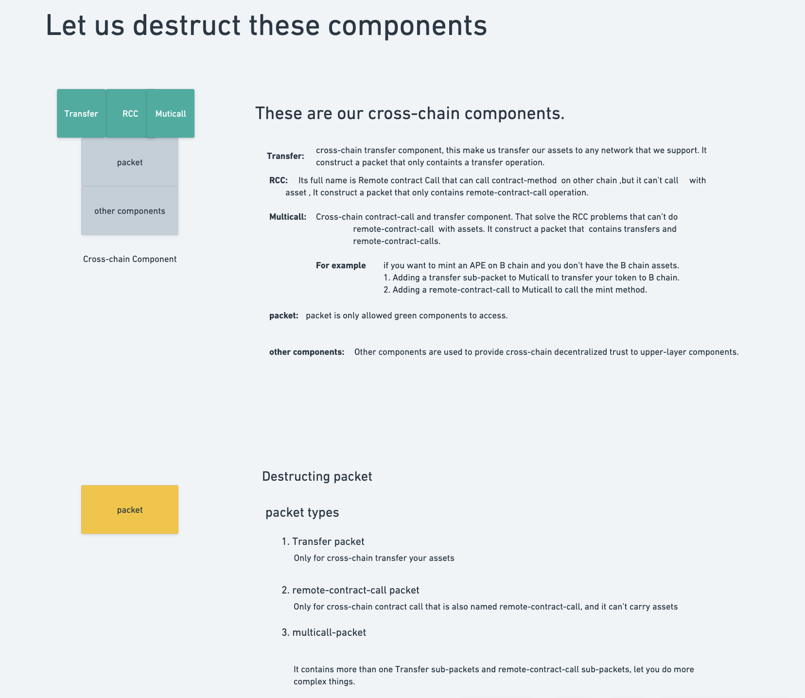

# xibc-apps
Cross-chain Dapps based on XIBC protocol

# Architecture

## Cross-chain Components

# Examples Overview
By reading the sample design documentation and code, you can get a better idea of how to build your own cross-chain Dapp on our XIBC protocol. The cross-chain examples are only intended to help you understand how to build on XIBC, but it cannot be used as production code, and that more testing and code audits are required after using the cross-chain examples as templates to keep your on-chain assets safe.👇
> PingPong \
📂pingpong\
This is a  example of `cross-chain contract call` that you can use at the developer level to test interoperability between two chains.

> CC721\
📂nft-cross-chain\
A cross-chain example of `NFT`, which shows you how to build cross-chain NFT between multiple chains and illustrates some considerations for NFT cross-chain.

> CrossChainSwap\
📂swap-with-teleport-pool\
A cross-chain example of a `swap` with teleport chain liquidity, more specifically a swap method that transfers assets and calls cross-chain Uniswap.

> FT-Transfer\
📂ft-transfer \
`Transfers` of assets can be made through our [Cross-Chain Bridge](https://bridge.testnet.teleport.network/)
