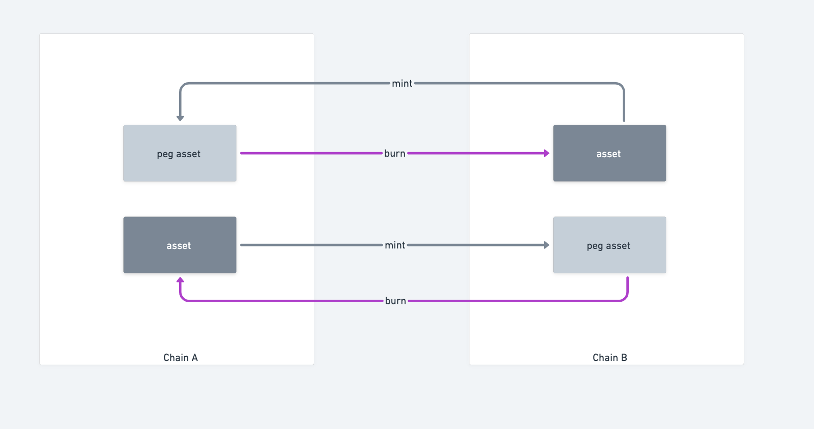

# Abstract
0. interaction sample figure
1. Asset flow chart
2. Cross-chain assets are supported
3. How do I send a cross-chain tx?
4. transfer period
   1. 

5. How to check the result of a cross-chain transfer tx?
6. How to deal with transfer error?

# Interaction sample figure


# Asset flow


# Token supported list


# Send transfer tx

1. construct you method args

2. send it like this

```js
        let transferData = {
            tokenAddress: erc20.address,
            receiver: (await accounts[1].getAddress()),
            amount: 1,
            destChain: destChainName,
            relayChain: relayChainName,
        }

        let Fee = {
            tokenAddress: "0x0000000000000000000000000000000000000000",
            amount: 0,
        }

        await transfer.sendTransfer(transferData, Fee)
```

3. get your PacketSent event by listen

```javascript
 let packetFactory = await hre.ethers.getContractFactory("Packet")
    let cts = utils.getChainContract(hre.network.name)
    let packetCt = packetFactory.attach(cts.packet)
    let pingpongFactory = await hre.ethers.getContractFactory("PingPongRC")
    let pingpongCt = pingpongFactory.attach(cts.pingpong)
    console.log("start listen PacketSent:", cts.packet)
    console.log("start listen AckPacket:", cts.packet)
    console.log("start listen RccPing:", cts.rcc)
    packetCt.on("PacketSent", (packet) => {
        console.log("\n===============enter PacketSent ==================")
        console.log("sequence", packet.sequence)
        console.log("sequence", packet.sequence.toString())
        console.log("sourceChain", packet.sourceChain)
        console.log("destChain", packet.destChain)
        console.log("relayChain", packet.relayChain)
        console.log("ports", packet.ports)

        console.log("===============end PacketSent ==================\n")
    })


```

# Period of a cross-chain transfer

# Check result

- [x] target chain on-chain  monitor

  1. Teleport 

  2. EVM

  ```javascript
  /**
  event: AckWritten(packet, ackBytes);
  
  struct Acknowledgement {
          bytes[] results;
          string message;
          string relayer;
  }
  */
  packetCt.on("AckWritten", (packet,ackbys) => {
          console.log("\n===============enter AckWritten ==================")
          console.log("sequence", packet.sequence)
          console.log("sequence", packet.sequence.toString())
          console.log("sourceChain", packet.sourceChain)
          console.log("destChain", packet.destChain)
          console.log("relayChain", packet.relayChain)
          console.log("ports", packet.ports)
    
    			
  				//parse Acknowledgement
    			let abicoder = ethers.utils.defaultAbiCoder 
          let ack = abicoder.decode(
          	["bytes[] results","string message","string relayer"],
            ackbys
          )
          console.log("ack.results",ack.results)
    			console.log("ack.message",ack.message)
    			console.log("ack.relayer",ack.relayer)
    			
          console.log("===============end AckWritten ==================\n")
      })
  ```

  

# Err Dealing

