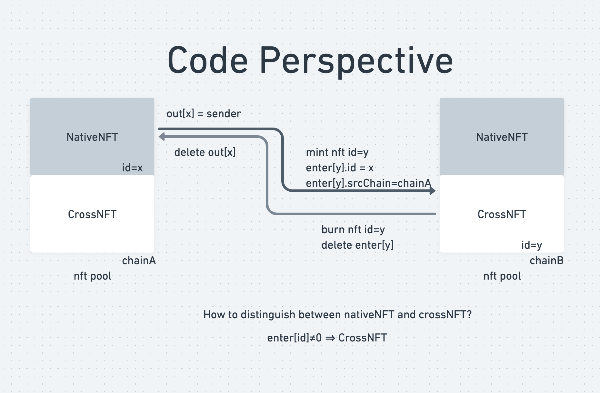

# NFT Cross-chain demo

# Abstract
1. nft cross-chain flow sample figure


# Asset flow

NFT is composed  of id and uri.

* id is the on-chain ownership.

* uri is the off-chain representation.


# StateMachine 



# Using  the example

1. cp `.env.example` to `.env` and  fill `.env` with yours config
2. commands

```bash
# setup enviroment
yarn 
# send nft cross-chain
yarn hardhat crosschain --id <yours> --destchain <yours> --relaychain <yours> --feeaddr <yours> --feeamount	<yours>
```

