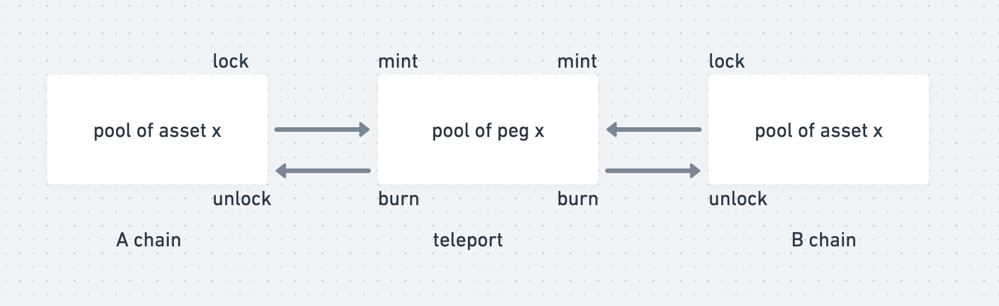
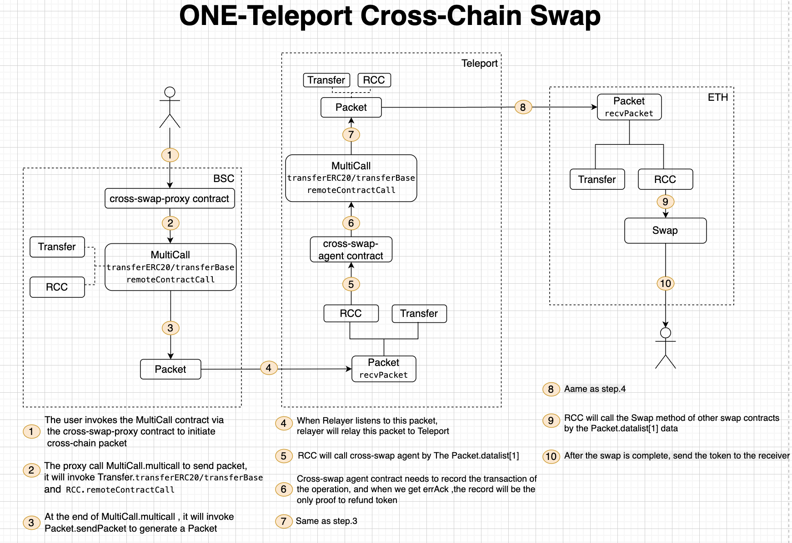

# Swap with teleport pool
Asset flow is as below. We use the pool of teleport that connects the same assets on different chains, which allows us to share the liquidity of all chains. That sound amazing, all right? Let's go on!

Swap flow as blow.

To make it a little bit more intuitive, this example only show how to cross-chain swap in a single direction.

