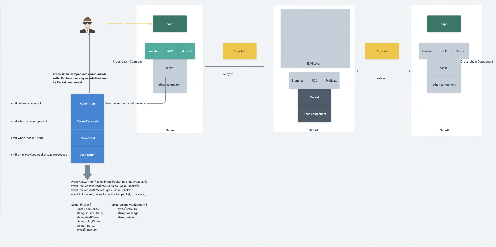
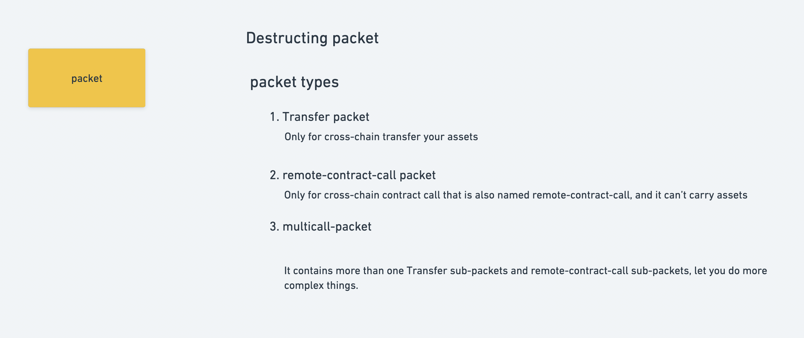
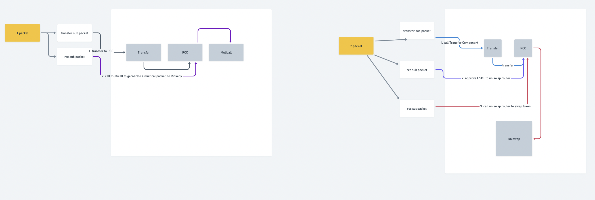

#  Architecture

Architecture figure

## Components

components figure

## packet

packet figure

# How does the example work?

There are two packets in the following figure that you find their position in the Architecture figure of Architecture section.

1. When we want to use teleport's liquidity and call Uniswap's swap in chainB for the tokens we want, we first need the Transfer component to move our funds and then use the RCC component to call Uniswap, So we need to use the Multicall component to combine Transfer and RCC to achieve our goal.

   1. We first need to call chainA's multicall. Multicall method to get `1.packet`. In the rcc sub-packet of the `1.packet` we need to call Teleport's Multicall to create `2.packet` , and the transfer sub-packet of the `1.packet` will transfer USDT to RCC contract. 
   2. After `2.packet` arrives at bChain, it will transfer token to RCC contract, and then we invoke approve of RCC to authorize USDT to the Router contract of Uniswap. We then call the swap method of the Uniswap Router via RCC to finish our work.

